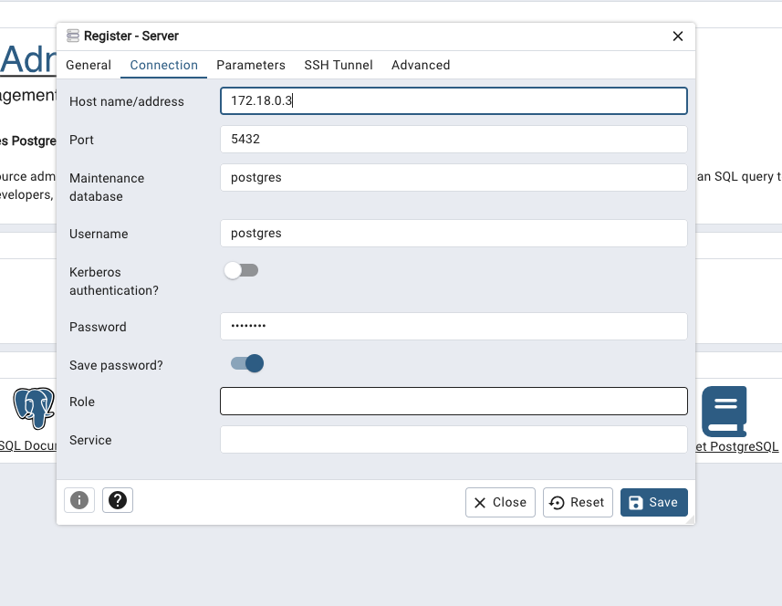
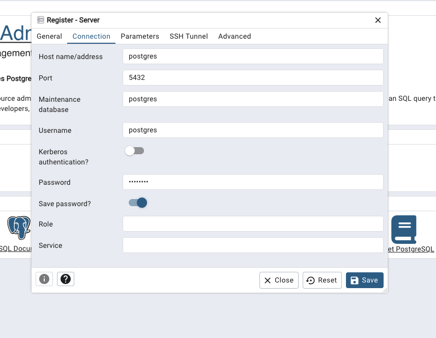
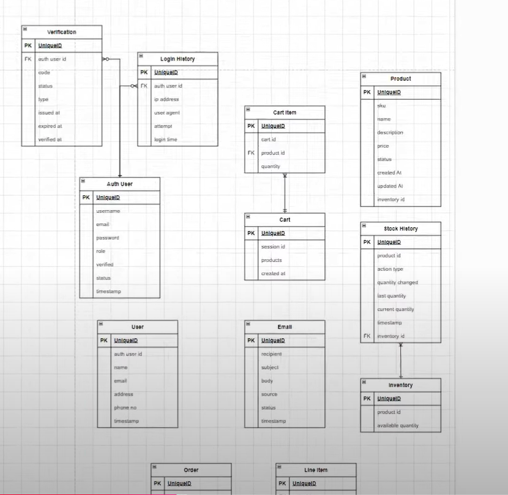
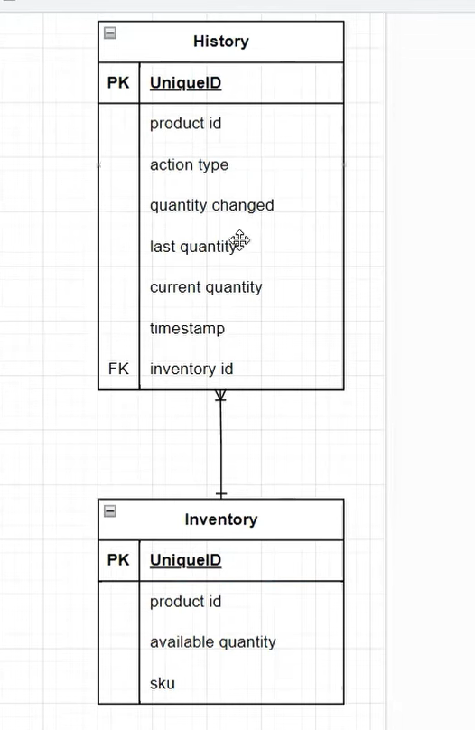

# Practical Microservice Project - Learn with Stack Learner

1. create docker compose file
2. docker compose up

## first we work with inventory service (servecs/inventory)

1. first npm install in the root folder (`npm i express cors dotenv morgan zod`)
2. index.ts is our Root file
3. create `controllers` folder and create `index.ts` file
4. for typescript we need install jod for type checking
5. and create schema for inventory
6. `npm i -D typescript tsc ts-node-dev tsc-alias tsconfig-paths` for run typescript
7. `npx tsc --init` for create tsconfig.json file 
8. now we see the error ,coz we setup tsconfig.json file
9. `npm i -D @types/express @types/node @types/cors @types/morgan` for type checking
10. then add `"scripts": { "dev": "ts-node-dev -r tsconfig-paths/register ./src/index.ts", "build": "tsc && tsc-alias" }` in package.json file
11. now we can run `npm run dev` for run the server

## now we work with postgres

1. we already run the postgres service in docker compose file
2. now visit `localhost:5050` in browser
3. now we can see the postgres is running
4. now login with `ismailkhandokar0@gmail.com` email and `admin` password
5. now create a new server `postgres-server`
6. a big provlem `localhost or using 127.0.0.1` will not work in `Connection` tab
7. now we need to inspect the `postgres` container and get the ip address `docker inspect postgres`
8. now we can see the ip address in the `Networks` section
9. now we can use the ip address in the `Connection` tab in `Host name/address` field

10. but ip address is not a good idea for production, because ip address can change
11. so we need to use the `postgres` name in the `Host name/address` field, and username and password is `postgres`

NOTE : `host.docker.internal` is a special Host name/address; if mac is not working `postgres`,then use `host.docker.internal`

## now we work with prisma

1. `npm i prisma @prisma/client --save-dev` for install prisma client
2. `npx prisma init --datasource-provider postgresql` for create prisma folder and prisma schema file

## Endponits 

## Modify ERD Diagram

- modify the ERD Diagram, now we have separeted the connected tables, this diagram is clearfy the relationship between the tables for specific service; and we will confirm how many services we need to create

## History and Inventory Service

