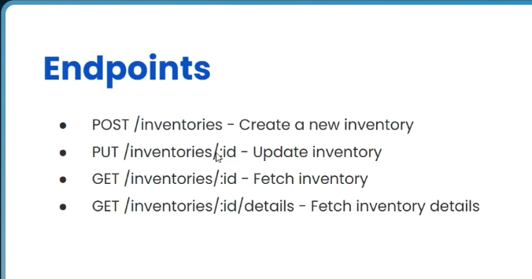

# Practical Microservice Project - Learn with Stack Learner

1. create docker compose file
2. docker compose up

## first we work with inventory service (servecs/inventory)

1. first npm install in the root folder (`npm i express cors dotenv morgan zod`)
2. index.ts is our Root file
3. create `controllers` folder and create `index.ts` file
4. for typescript we need install jod for type checking
5. and create schema for inventory
6. `npm i -D typescript tsc ts-node-dev tsc-alias tsconfig-paths` for run typescript
7. `npx tsc --init` for create tsconfig.json file 
8. now we see the error ,coz we setup tsconfig.json file
9. `npm i -D @types/express @types/node @types/cors @types/morgan` for type checking
10. then add `"scripts": { "dev": "ts-node-dev -r tsconfig-paths/register ./src/index.ts", "build": "tsc && tsc-alias" }` in package.json file
11. now we can run `npm run dev` for run the server


## now we work with postgres

1. we already run the postgres service in docker compose file
2. now visit `localhost:5050` in browser
3. now we can see the postgres is running
4. now login with `ismailkhandokar0@gmail.com` email and `admin` password
5. now create a new server `postgres-server`
6. a big provlem `localhost or using 127.0.0.1` will not work in `Connection` tab
7. now we need to inspect the `postgres` container and get the ip address `docker inspect postgres`
8. now we can see the ip address in the `Networks` section
9. now we can use the ip address in the `Connection` tab in `Host name/address` field

10. but ip address is not a good idea for production, because ip address can change
11. so we need to use the `postgres` name in the `Host name/address` field, and username and password is `postgres`


NOTE : `host.docker.internal` is a special Host name/address; if mac is not working `postgres`,then use `host.docker.internal`

## now we work with prisma

1. `npm i prisma @prisma/client --save-dev` for install prisma client
2. `npx prisma init --datasource-provider postgresql` for create prisma folder and prisma schema file

## Endponits 


## Modify ERD Diagram

- modify the ERD Diagram, now we have separeted the connected tables, this diagram is clearfy the relationship between the tables for specific service; and we will confirm how many services we need to create

## History and Inventory Service


## Create Inventory Service

`{{bash}}/inventories`

```js
{
    "productId":"test_idd",
    "sku":"test_skud"
}
```
- create inventory
- update inventory
- get inventory by id
- get inventory details by id

# now we work with Product Service


# now Complete Product Service
- create Product Service
- Get All Products
- Get Product By Id

## Inventory and Product Service er jonno amra 2ta service create korsi; akhon client k eto kiso jananor dorkar nai, client k akta matro url dibo jekhane hit korle 2ta service er response asbe; er jonno  `Api Gateway` service create korte hobe;

# Api Gateway Service


### Most important file is `config.json` && `utils.ts` file; ai 2 ta file er kaj holo `Api Gateway` service er kaj;

- `http://localhost:8081/api/inventories/cm3r4p8mp00007sdm1j8d2i22/details` -> `inventory by id     `
- `http://localhost:8081/api/products/cm3r4p8mp00007sdm1j8d2i22` -> `single product`
- `http://localhost:8081/api/products` -> `all products`

# Rate Limiting
Rate limiting check korar jonno `express-rate-limit` package use kora hoyeche; `index.ts` file e rate limiting 5 korbe; 15 minutes er moddhe 5 ta request accept korbe; er besi korle 429 error dibe; DDOS attack theke protect korar jonno use kora hoyeche; 
Postmane Show this response , if we hit more than 5 times in 15 minutes;
```js
{
    "message":"Too many requests from this IP, please try again in 15 minutes"
}
```

# Access Denied
amra jehoto `Api Gateway` service create korsi, jekhane `inventory` &&  `product` service er response asbe; er jonno `Api Gateway` service er `config.json` file e `inventory` && `product` service er `origin` set kora hoyeche;
akhon amra chai na baire theke `inventory` && `product` service er endpoint hit korte parok; er jonno akta middleware create korbo `index.ts` file e; both service er khetre;(`inventory`&&`product`)


# Day 3 - Implementing Authentication Service


`src10` image e chart e follow kora hoyse; we create the service serrilay;
- 1st `user Service`
- 2nd `Email Service`,
- 3rd `Auth Service`